# Diagnosics Handling subsystem

This is the file where I put the diagnostics handling documentation. 

The diagnostics handling subsystem is a class that is created in the ls class under DiagnosticsHandlingSubsystem . 

The subsystem is currently located under utils/DiagnosticsHandlingSubsystem

# Architecture
I will explain the architecture the best I can.
> [!NOTE]
> The server is pull based, so **publishing** refers to exposing them to the client

## On creation : 
On construction of the class, it builds an SQLite DB for diagnostics storage. 

## Exposes methods:
| method | parameters | explanation | usage_example |
| ------------- | -------------- | -------------- | ------------- |
| load_all_diagnostics | None | Loads and publishes all the diagnostics from the DB. Also tells the client to update the diagnostics | load_all_diagnostics(None) |
| load_diagnostics_for_file | uri | Loads the diagnostics for a single file. Also tells the client to refresh diagnostics | load_diagnostics_for_file(doc.uri) |
| save_new_diagnostics() | DiagnosticsPydanticobject ; Diagnostics Type | This method saves new diagnostics to the DB.  | save_new_diagnostics(New_Diagnostics_fresh_from_Langchain, "Deep") |
| register_new_write(uri) | uri | registeres a new write to the DB. | register_new_write(params.document.uri) |

## Operational Schema

```mermaid
flowchart TB
    subgraph AIDiagnosLSP["AIDiagnosLSP (Main Server)"]
        direction LR
        LS[("LSP Server Instance")]
    end

    subgraph DHS["DiagnosticsHandlingSubsystem"]
        direction TB
        DHS_obj["DiagnosticsHandlingSubsystemClass"]
        DB_lock["threading.Lock()"]
        conn[("SQLite Connection<br/>(diagnostics.db)")]
        ttl_del["TTLBasedDeletionThread<br/>(runs every 360s)"]
        ttl_inv["TTLBasedDiagnosticsInvalidationThread<br/>(runs every 2s)"]
        ls["language server object"]

        DHS_obj --> DB_lock
        DHS_obj --> conn
        DHS_obj --> ttl_del
        DHS_obj --> ttl_inv
        DHS_obj --> ls

        ls <-- "Shared object" --> LS
        subgraph methods["Callable Methods"]
            direction TB
            register_file_write["register_file_write"]
            save_new_diagnostic["save_new_diagnostic"]
            load_all_diagnostics["load_all_diagnostics"]
            load_diagnostics_for_file["load_diagnostics_for_file"]

            register_file_write -- writes to --> files_column_last_changed_at
            register_file_write -- writes to --> files_column_uri
        end
        DHS_obj ---> methods
    end

    subgraph Database["SQLite Schema"]
        direction LR
        subgraph files["files"]
            files_column_uri["column: uri"]
            files_column_last_changed_at["column: last_changed_at"]
        end
        subgraph diag_basic["diagnostics_Basic"]
            diag_basic_uri["columnn: uri"]
            diag_basic_diagnostics["columnn: diagnostics"]
            diag_basic_created_at["column: created_at"]
        end
        diag_cross["diagnostics_CrossFile<br/>(...)"]
        diag_logic["diagnostics_Logic<br/>(...)"]
        diag_style["diagnostics_Style<br/>(...)"]
        diag_security["diagnostics_Security<br/>(...)"]
        diag_deep["diagnostics_Deep<br/>(...)"]
        view["all_diagnostics_view<br/>(UNION of all diagnostic tables)"]

        diag_basic --> view
        diag_cross --> view
        diag_logic --> view
        diag_style --> view
        diag_security --> view
        diag_deep --> view

        diag_basic -- "Foreign key uri referenses to" --> files_column_uri
        diag_cross -- "Foreign key uri referenses to" --> files_column_uri
        diag_logic -- "Foreign key uri referenses to" --> files_column_uri
        diag_style -- "Foreign key uri referenses to" --> files_column_uri
        diag_security -- "Foreign key uri referenses to" --> files_column_uri
        diag_deep -- "Foreign key uri referenses to" --> files_column_uri

        files_column_uri -- "On delete cascade" --> diag_basic
        files_column_uri -- "On delete cascade" --> diag_cross
        files_column_uri -- "On delete cascade" --> diag_logic
        files_column_uri -- "On delete cascade" --> diag_style
        files_column_uri -- "On delete cascade" --> diag_security
        files_column_uri -- "On delete cascade" --> diag_deep
    end

    subgraph Conversion["Diagnostic Conversion"]
        func1["GeneralDiagnosticsPydanticToLSProtocol()"]
        note_1["Will be expanded later"]
    end

    subgraph external["External world"]
        LSP["Language server"]
        LSP <-- is a shared object --> ls
        callers["External callers"]
        Client["The editor"] 
    end

    %% Interactions

    callers -- "calls" --> methods

    load_all_diagnostics -- "use" --> func1
    load_diagnostics_for_file -- "use" --> func1

    load_all_diagnostics -- "Gives the diagnostics to" --> ls
    load_diagnostics_for_file -- "Gives the diagnostics to" --> ls
    ls -- "publishes diagnostics via<br/>workspace/diagnostic/refresh" --> Client
    ls -- "publishes diagnostics via<br/>workspace/diagnostic/refresh" --> Client

    ttl_inv -- "deletes stale diagnostics<br/>(last_change - created_at > ttl_invalidation)" --> diag_basic
    ttl_inv -- "deletes stale diagnostics<br/>(last_change - created_at > ttl_invalidation)" --> diag_cross
    ttl_inv -- "deletes stale diagnostics<br/>(last_change - created_at > ttl_invalidation)" --> diag_logic
    ttl_inv -- "deletes stale diagnostics<br/>(last_change - created_at > ttl_invalidation)" --> diag_style
    ttl_inv -- "deletes stale diagnostics<br/>(last_change - created_at > ttl_invalidation)" --> diag_security
    ttl_inv -- "deletes stale diagnostics<br/>(last_change - created_at > ttl_invalidation)" --> diag_deep

    ttl_del -- "Deletes records of old files based on a really long wait time. " --> files

    LSP --> Client
```

## SQL Schema

| table name | colums list | use case |
| ----| ---- | ---- |
| files | uri ; last_changed_at | for tracking file writes |

